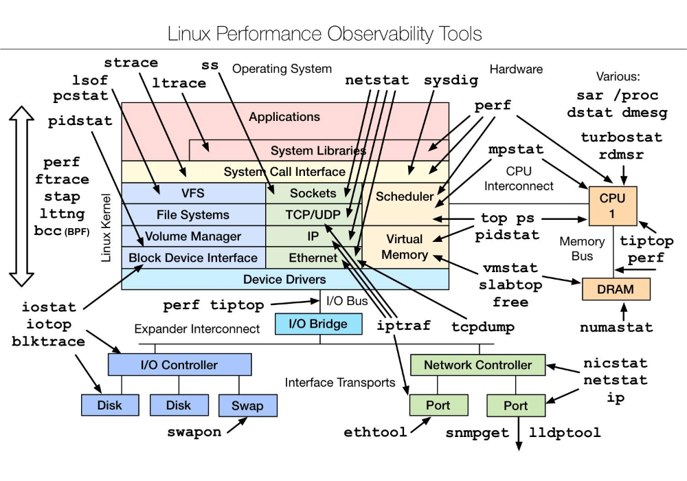

# 绪论

epoll是linux上的系统调用函数，同select功能类似。

设备中断，缺页异常中断，定时中断，系统调用 会进程切换，是有成本的。

一般有内核态和用户态，cpu是执行引擎，用户进程只能在用户态执行，如果有特别需要比如设备中断，缺页异常中断，定时中断，系统调用 会切换到内核态执行，进行了进程的切换了。

 内核态主要是对硬件进行了封装和隐藏，防止错误程序或者恶意程序进程对其他进程进行干扰，起到保护作用。 

内存寻址，有物理内存和虚拟逻辑内存，之间有对应关系，这个是怎么建立起来的呢。

用户和用户组，文件和文件组，进程和进程组。

进程间通信有哪些？ 信号量—+自旋锁，共享内存，消息队列。

### 为什么要有内存管理？
我们知道，一个进程完成他的功能，需要访问磁盘加载数据到内存然后等待进入cpu运算，因为数据量大小远远大于内存大小。因此提出虚拟内存概念。虚拟内存就是将程序用到的数据进行划分，暂时用不到的放到磁盘里，用到的放到内存里，操作系统中总是运行着不止一个进程，各个进程有优先级顺序，所以存在进程调度问题，进程的每次调度都会导致内存和磁盘数据置换，段式内存管理页式内存管理都是基于虚拟内存概念的具体内存管理解决方案。

###  什么是页式内存管理？
虚拟内存位于程序和物理内存之间，程序只能看见虚拟内存，再也不能直接访问物理内存。每个程序都有自己独立的进程地址空间，这样就做到了进程隔离。这里的进程地址空间是指虚拟地址。顾名思义，既然是虚拟地址，也就是虚的，不是现实存在的地址空间。既然我们在程序和物理地址空间之间增加了虚拟地址，那么就要解决怎么从虚拟地址映射到物理地址，因为程序最终肯定是运行在物理内存中的，主要有分段和分页两种技术。分页机制就是把内存地址空间分为若干个很小的固定大小的页，每一页的大小由内存决定，就像Linux中ext文件系统将磁盘分成若干个Block一样，这样做是分别是为了提高内存和磁盘的利用率。

### 页的大小为什么是4K?
CPU位数准确地说应该是CPU一次能够并行处理的数据宽度，一般就是指数据总线宽度。

### 用户态和核心态的区别？

* 操作系统需要两种CPU状态：
  * 内核态（Kernel Mode）：运行操作系统程序
  * 用户态（User Mode）：运行用户程序

* 指令划分：
  * 特权指令：只能由操作系统使用，用户程序不能使用的指令。  举例：启动I/O	内存清零	修改程序状态字  设置时钟	允许/禁止终端	停机
  * 非特权指令：用户程序可以使用的指令。  举例：控制转移  算数运算  取数指令   访管指令（使用户程序从用户态陷入内核态）

* 特权级别：

  特权环：R0、R1、R2和R3

  R0相当于内核态，R3相当于用户态，不同级别能够运行不同的指令集合

* CPU状态之间的转换：

  * 用户态--->内核态：唯一途径是通过中断、异常、陷入机制（访管指令）

  * 内核态--->用户态：设置程序状态字PSW

* 内核态与用户态的区别：
  * 内核态与用户态是操作系统的两种运行级别，当程序运行在3级特权级上时，就可以称之为运行在用户态。因为这是最低特权级，是普通的用户进程运行的特权级，大部分用户直接面对的程序都是运行在用户态	
  * 当程序运行在0级特权级上时，就可以称之为运行在内核态。
  * 运行在用户态下的程序不能直接访问操作系统内核数据结构和程序。当我们在系统中执行一个程序时，大部分时间是运行在用户态下的，在其需要操作系统帮助完成某些它没有权力和能力完成的工作时就会切换到内核态。
  * 这两种状态的主要差别是：处于用户态执行时，进程所能访问的内存空间和对象受到限制，其所处于占有的处理机是可被抢占的 ；而处于核心态执行中的进程，则能访问所有的内存空间和对象，且所占有的处理机是不允许被抢占的。

* 通常来说，以下三种情况会导致用户态到内核态的切换：

  * 系统调用，这是用户态进程主动要求切换到内核态的一种方式**，**用户态进程通过系统调用申请使用操作系统提供的服务程序完成工作。比如fork()实际上就是执行了一个创建新进程的系统调用。而系统调用的核心机制是使用了操作系统为用户特别开放的一个中断来实现，例如Linux的int 80h中断。
  * 异常：当CPU在执行运行在用户态下的程序时，发生了某些事先不可知的异常，这时会触发由当前运行进程切换到处理此异常的内核相关程序中，也就转到了内核态，比如缺页异常。
  * 外围设备的中断，当外围设备完成用户请求的操作后，会向CPU发出相应的中断信号，这时CPU会暂停执行下一条即将要执行的指令转而去执行与中断信号对应的处理程序，如果先前执行的指令是用户态下的程序，那么这个转换的过程自然也就发生了由用户态到内核态的切换。比如硬盘读写操作完成，系统会切换到硬盘读写的中断处理程序中执行后续操作等。

  这3种方式是系统在运行时由用户态转到内核态的最主要方式，其中系统调用可以认为是用户进程主动发起的，异常和外围设备中断则是被动的。

# 内存寻址


IO密集型 ，cpu不直接访问磁盘/网络，从磁盘或网络加载到内存的过程称为input,反之output，即IO。当频繁需要加载数据到内存，则IO loading很高。

CPU密集型 cpu loading很高，不太访问io，通常是计算、逻辑判断多的场景发生。


网上这张图写的很详细，收藏：


### 进程

1. 进程的定义

   程序执行时的一个实例，可以看做是描述程序已经执行到何种程度的数据结构的汇集，进程的目的是分配CPU时间和内存的实体。

2. 进程的静态特性

3. 进程的切换

4. 进程的创建和撤销

**什么是系统调用？**


# Linux




C10K问题（1w clients）

解决方案

select 

poll

epoll 


cpu负载率 和 cpu使用率

cpu负载率，是指单位时间内单个cpu的待执行线程的数量。

cpu使用率，是指单位时间内cpu的运行时间

cpu负载高 cpu使用率不一定高


### Linux命令总结

**top**

top -Hp  279354  #查看279354进程下的线程cup占用情况

```
top - 10:44:51 up 84 days, 19:31,  3 users,  load average: 1.35, 1.13, 1.18
  	  当前系统时间  运行时长           登录用户数 平均负载（1分钟 5分钟 15分钟）
Tasks: 1022 total,   1 running, 1018 sleeping,   2 stopped,   1 zombie
       总进程数       正在运行进程数 睡眠进程数        停止进程数    僵死进程数
%Cpu(s):  1.5 us,  1.0 sy,  0.0 ni, 97.5 id,  0.0 wa,  0.0 hi,  0.1 si,  0.0 st
       用户态cpu占比 内核态cpu占比 /   空闲cpu占比 待输入输出占比 /    软中断cpu占比
				  用户进程改过优先级cpu占比                硬中断cpu占比
KiB Mem : 13124375+total,  8190356 free, 74655760 used, 48397632 buff/cache
千字节     物理内存总量       空闲总量        已使用总量       缓存的内存量
KiB Swap: 33554428 total, 32985780 free,   568648 used. 52627500 avail Mem 
          交换区内存总量     空闲总量         已使用总量       缓存的内存量
   PID USER      PR  NI    VIRT    RES    SHR S  %CPU %MEM     TIME+ COMMAND            		   
187260 root      20   0   25.6g 125156   4216 S  23.6  0.1   2985:30 beam.smp 

PID 进程ID
USER  进程所有者
PR 进程优先级
NI nice值，负值表示高优先级，正值表示低优先级
VIRT 进程使用的虚拟内存总量 单位kb, VIRT = SWAP + RES
RES 进程使用的、未被置换出的物理内存大小 单位kb RES = CODE + DATA
SHR 共享内存大小 单位kb
S 进程状态 D=不可中断的睡眠状态 R=运行 S=睡眠 T=跟踪或停止 Z=僵尸进程
%CPU 上次更新到现在的cpu时间占用百分比
%MEM 进程使用的物理内存百分比
TIME+ COMMAND   进程名称（命令名/命令行）
```


> swap分区，简单理解是当系统的物理内存不够用时，将很长时间没有操作的程序占用的空间临时保存到swap分区中，等待这些程序要运行时，再从swap中恢复到内存中去。


查看端口被那个进程占用:

```
[root@iZj6ciemoke3l16l2bizu2Z ~]# lsof -i:80
COMMAND     PID USER   FD   TYPE  DEVICE SIZE/OFF NODE NAME
AliYunDun 12802 root   21u  IPv4 1880245      0t0  TCP iZj6ciemoke3l16l2bizu2Z:39732->100.100.30.25:http (ESTABLISHED)
```


**操作系统思想**

提供机制，而不是策略。（有哪些提供机制，而不是策略的例子？copy: 1. 管道是机制，应用管道处理各种数据是策略 2. awk循环读入行是机制，参数和正则是策略 3. 输入法是机制 码表是策略 4. 乐高积木的凹槽凸点是机制，各种拼法是策略 5. 定时器结构是一种CPU保护的机制，但对于特定用户将定时器设置成多长时间是个策略问题）。

注：

unix编程艺术之一，提供机制，而不是决策。算是最好的编程思想之一。

awk是强大的文本处理工具。


### vmstat

含义为显示虚拟内存状态（Virtual Memory Statistics)，但是它可以报告关于进程，内存，I/O等系统整体运行状态。

```xshell
[root@pmshost001 ~]# vmstat 1
procs -----------memory---------- ---swap-- -----io---- -system-- ------cpu-----
 r  b   swpd   free   buff  cache   si   so    bi    bo   in   cs us sy id wa st
 1  0 2687840 678600 149608 1446928    0    0     9    12    0    0  1  0 99  0  0
 0  0 2687840 678020 149608 1446928    0    0     0    56 6968 9012  4  1 95  0  0
 2  0 2687840 678176 149608 1446928    0    0     0     0 3744 3954  0  0 99  0  0
 0  0 2687840 678144 149608 1446944    0    0     0    52 3968 4286  1  0 99  0  0
```

* procs 进程
  * r 运行队列中正在运行的进程数，这个值也可以判断是否需要增加CPU数量（若长期大于1）
  * b等待IO的进程数量。

* memory内存
  * swpd 使用虚拟内存大小，若swpd不为0，swap长期为0，这种情况不会影响系统性能，为什么？
  * free 空闲的物理内存大小
  * buff缓冲，用作缓冲的内存大小，可能和IO/bo的数值有关系（猜测。
  * cache缓存，若cache 值大，说明cache的文件数多，如果缓存命中率大，那么磁盘IO/bi会非常小
* swap
  * si 每秒从交换区写到内存的大小，由磁盘调入内存
  * so每秒从内存写到交换区的大小，由内存写入磁盘
  * 注意：内存够用时，这两个值都为0，若si/so两个值长期大于0，系统性能会受到影响。 另外free很少接近0时，不代表内存不够用了，若si/so也很少，这种情况系统性能通常不会受到影响（利用了交换区？）。

* IO
  * bi每秒读取的块数
  * bo每秒写入的块数
  * 注意：随机磁盘读写的时候，这两个值越大（如超出1024k) 能看到cpu在IO等待的值也越大。

* System
  * in 每秒中断数，包括时钟中断
  * cs 每秒上下文切换数（java thread的上下文切换可以看这个值？）
  * 注意：in/cs的值越大，代表着内核消耗cpu的时间越大。
* CPU以百分比表示
  * us用户进程执行时间百分比 （user time)，这个值越高，代表着用户态消耗cpu时间多，如果长期超过50%,则可以考虑优化程序算法或加速
  * sy内核进程执行时间百分比，这个值越高，代表着内核态消耗cpu时间多，这不是良性表现，应该排除原因。
  * wa:IO等待时间百分比，wa值越高，说明IO等待比较严重，可能由于磁盘大量做随机访问造成，也可能磁盘出现瓶颈（块操作）。
  * id:空闲时间百分比


**ls命令**

硬链接 `ln /root/f1/a.txt /root/f2`

软链接 `ln -s /root/f1/a.txt /root/f2`

**查看详细信息：**

`[root@iZj6ciemoke3l16l2bizu2Z f2]# ls -ahl
total 8.0K
drwxr-xr-x   2 root root 4.0K Sep 23 15:09 .
dr-xr-x---. 13 root root 4.0K Sep 23 08:24 ..
lrwxrwxrwx   1 root root   14 Sep 23 15:09 a.txt -> /root/f1/a.txt`

第一位代表文件类型 d(目录) -(文件) l(软连接) 

第二到四位表示文件拥有者的权限 接着是文件拥有者所在组的用户所能拥有的权限 再接着三位是其他用户组所能拥有的权限（不和文件所有者一组的） 

第一个root是当前文件的拥有者用户 第二个root是文件拥有者所在的组 

然后是文件大小

文件最后修改时间

文件名`a.txt -> /root/f1/a.txt`

**修改用户组对文件的权限，u\g\o三个用户管理组**

`[root@iZj6ciemoke3l16l2bizu2Z f2]# mkdir abc
[root@iZj6ciemoke3l16l2bizu2Z f2]# ls -ahl
total 12K
drwxr-xr-x   3 root root 4.0K Sep 23 15:22 .
dr-xr-x---. 13 root root 4.0K Sep 23 08:24 ..
drwxr-xr-x   2 root root 4.0K Sep 23 15:22 abc
lrwxrwxrwx   1 root root   14 Sep 23 15:09 a.txt -> /root/f1/a.txt`

`[root@iZj6ciemoke3l16l2bizu2Z f2]# chmod o-xr abc/
[root@iZj6ciemoke3l16l2bizu2Z f2]# ls -ahl
total 12K
drwxr-xr-x   3 root root 4.0K Sep 23 15:22 .
dr-xr-x---. 13 root root 4.0K Sep 23 08:24 ..
drwxr-x---   2 root root 4.0K Sep 23 15:22 abc
lrwxrwxrwx   1 root root   14 Sep 23 15:09 a.txt -> /root/f1/a.txt
[root@iZj6ciemoke3l16l2bizu2Z f2]# chmod 577 abc
[root@iZj6ciemoke3l16l2bizu2Z f2]# ls -ahl
total 12K
drwxr-xr-x   3 root root 4.0K Sep 23 15:22 .
dr-xr-x---. 13 root root 4.0K Sep 23 08:24 ..
dr-xrwxrwx   2 root root 4.0K Sep 23 15:22 abc
lrwxrwxrwx   1 root root   14 Sep 23 15:09 a.txt -> /root/f1/a.txt`

`[root@iZj6ciemoke3l16l2bizu2Z f2]# rename abc abd abc
[root@iZj6ciemoke3l16l2bizu2Z f2]# ls -ahl
total 12K
drwxr-xr-x   3 root root 4.0K Sep 23 15:25 .
dr-xr-x---. 13 root root 4.0K Sep 23 08:24 ..
dr-xrwxrwx   2 root root 4.0K Sep 23 15:22 abd
lrwxrwxrwx   1 root root   14 Sep 23 15:09 a.txt -> /root/f1/a.txt`

`[root@iZj6ciemoke3l16l2bizu2Z f2]# chmod u=rwx,g=r,o=r abd/
[root@iZj6ciemoke3l16l2bizu2Z f2]# ls -ahl
total 12K
drwxr-xr-x   3 root root 4.0K Sep 23 15:25 .
dr-xr-x---. 13 root root 4.0K Sep 23 08:24 ..
drwxr--r--   2 root root 4.0K Sep 23 15:22 abd
lrwxrwxrwx   1 root root   14 Sep 23 15:09 a.txt -> /root/f1/a.txt
[root@iZj6ciemoke3l16l2bizu2Z f2]# chmod g+w,o-r abd`

**改变目录abd的所有者为root**

 `[root@iZj6ciemoke3l16l2bizu2Z f2]# chown root abd`

**改变abd目录下所有文件的所有者**

`[root@iZj6ciemoke3l16l2bizu2Z f2]# chown -R root abd/`

**改变abd所在组，前提是当前登录用户必须是该文件的拥有者 或超级用户**

`[root@iZj6ciemoke3l16l2bizu2Z f2]# chgrp root abd`


### 缓冲（buffer）和缓存（cache）的区别？

缓冲（buffer）是写入磁盘时，把分散的数据先写入缓冲，再一次性写入磁盘，把分散的写操作集中进行，减少磁盘的寻道和磁盘碎片，从而提高性能。

缓存（cache）是在读取磁盘的数据时，将最常用的数据放入到内存的缓存区，再次读取数据时，先去内存缓存取读取，读取不到再去磁盘读取。相关算法：LRU （least recently used )算法，淘汰最近最少使用(按时间顺序排序，最近使用的排在前面)，FIFO先进先出算法等。


```java
//手写LRU算法
public class LruDemo{
	class Node{
		Node next;
		Object val;
		Object key;
		Node(Object key,Object val){
			this.val = val;
			this.key = key;
		}
	}
	Node head ;
	public synchronized Object lru(Object key){
		if(head == null){
			Node node = new Node(key,get(key));
			head = node;
		}
		  
		if(head.key == key){  
			return p1.val;
		}
		if(head.next == null){
			Node node = new Node(key,get(key));
			node.next = head;
			head = node;
			return node.val;
		}
		
		Node p1 = head.next;
		Node p2 = head;
		
		while(p1.next != null){
			if(p1.key == key){ 
				Object res = p1.val;
				p2.next = p1.next;
				p1.next = head;
				head = p1;
				return res;
			}
			p2 = p1;
			p1 = p1.next;
		}
		
		p2.next = null;
		p1.next = head;
		head = p1;
		if(head.key != key){
			head.key = key;
			head.val = get(key);
		} 
		return head.val; 
	}
	public Object get(){
		//从磁盘获取
	}
}
```

